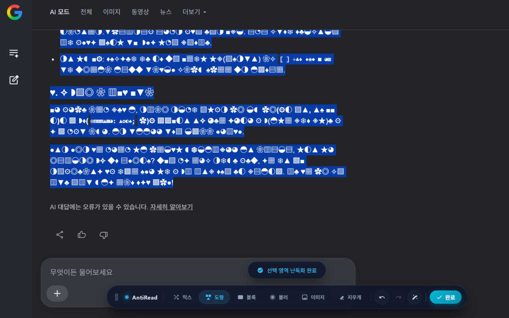

# AntiReadability - 민감 정보 난독화 도구

AntiReadability는 웹페이지를 화면 캡처하거나 스크린샷으로 공유할 때, 유출되기 쉬운 개인정보 및 민감 데이터(이름, 주소, 계좌번호, 이메일, 프로필 사진 등)를 원래 레이아웃의 깨짐 없이 마스킹할 수 있는 Chrome 확장 프로그램입니다.

※ 크롬 웹스토어에 "AntiReadability - 민감 정보 난독화 도구"로 등록 예정입니다.

---

## 🌟 주요 기능

1. **텍스트 믹스 (Mix/Scramble)**
   - 한글 -> 무작위 한글, 영어 -> 무작위 영어, 숫자 -> 무작위 숫자로 1:1 문자 매핑 치환합니다.
   - 글자 수와 너비가 거의 완벽하게 보존되므로 페이지 레이아웃이 무너지지 않습니다.

2. **도형 치환 (Geometric)**
   - 문자를 `■`, `▲`, `●`, `★`, `♠` 등 기하학적 도형 기호(U+25A0 ~ U+26FF)로 치환합니다.
   - 데이터 가독성은 차단하면서 문맥의 형태는 파악할 수 있도록 해줍니다.

3. **블랙 블록 (Block)**
   - 기밀 문서 검열 스타일인 검은색 블록(`█`) 캐릭터로 글자를 덮어씌웁니다.

4. **블러 필터 (Blur)**
   - CSS 블러 효과를 드래그한 텍스트 범위에 직접 적용합니다.

5. **이미지 블러 (Image Blur)**
   - '이미지' 모드를 켠 뒤, 웹페이지 내의 이미지를 클릭하면 해당 이미지가 흐리게(`blur`) 처리됩니다.

6. **지우개 및 복원 (Restore / Eraser)**
   - '지우개' 모드를 켠 뒤, 이미 난독화된 텍스트 영역을 드래그하거나 흐려진 이미지를 클릭하면 원래 상태로 복원됩니다.

7. **단축키 및 히스토리**
   - 실행 취소(`Ctrl+Z`) 및 다시 실행(`Ctrl+Y`)을 지원하며 전체 페이지 난독화도 버튼 클릭 한 번으로 수행할 수 있습니다.

---

## 🛠️ 설치 방법 (개발자 모드)

1. 이 저장소를 복사(Clone)하거나 ZIP 파일로 다운로드하여 압축을 풉니다.
2. Google Chrome 브라우저를 열고 `chrome://extensions/`로 이동합니다.
3. 우측 상단의 **'개발자 모드'** 스위치를 켭니다.
4. 좌측 상단의 **'압축해제된 확장 프로그램을 로드합니다'** 버튼을 클릭합니다.
5. 이 저장소의 `AntiReadability` 폴더(안에 `manifest.json`이 있는 폴더)를 선택합니다.

---

## 🚀 사용법

1. 임의의 웹페이지를 엽니다.
2. 페이지 아무 곳이나 마우스 우클릭한 후 **'민감 정보 난독화 시작'**을 누르거나, 브라우저 우측 상단 확장 프로그램 팝업 창에서 **'현재 탭에서 난독화 시작'** 버튼을 누릅니다.
3. 하단에 나타나는 캡슐 툴바에서 원하는 난독화 모드를 선택합니다.
4. **텍스트 영역을 드래그**하거나 **이미지를 클릭**하여 민감 정보를 숨깁니다.
   - *팁: 난독화 모드가 켜진 동안에는 링크 클릭이 일시 정지되므로 하이퍼링크 텍스트도 간편하게 드래그하여 가릴 수 있습니다.*
5. 작업 완료 후 툴바의 **'완료'** 버튼을 누르면 컨트롤러가 화면에서 사라져 깨끗한 스크린샷 촬영이 가능합니다.

---
---

# AntiReadability - Sensitive Info Masking Tool

AntiReadability is a Chrome extension that helps you mask sensitive personal information (names, addresses, account numbers, emails, profile pictures, etc.) on webpages before taking or sharing screenshots, without breaking the page layout.

※ Scheduled to be registered on the Chrome Web Store as "AntiReadability - 민감 정보 난독화 도구".

---

## 🌟 Key Features

1. **Text Scramble (Mix)**
   - Replaces Hangul with random Hangul, English with English, and digits with digits.
   - The exact character count and layout width are preserved, preventing visual shifts.

2. **Geometric Shapes**
   - Substitutes characters with visual symbols from the U+25A0 ~ U+26FF range (e.g., `■`, `▲`, `●`, `★`, `♠`).
   - Blocks data readability while keeping the shape structure of the page.

3. **Black Block (Redaction)**
   - Redacts characters by covering them with traditional solid black blocks (`█`).

4. **CSS Blur**
   - Applies a blur CSS filter directly to the highlighted text selection.

5. **Image Blur**
   - Switch to 'Image' mode and click on any webpage image to apply a heavy CSS blur.

6. **Restore (Eraser)**
   - Switch to 'Eraser' mode and drag over masked text or click blurred images to restore them to their original values.

7. **Shortcuts & History**
   - Supports Undo (`Ctrl+Z`), Redo (`Ctrl+Y`), and page-wide instant masking.

---

## 🛠️ Installation (Developer Mode)

1. Clone this repository or download and extract the ZIP file.
2. Open Google Chrome and navigate to `chrome://extensions/`.
3. Enable the **'Developer mode'** toggle in the top-right corner.
4. Click the **'Load unpacked'** button in the top-left corner.
5. Select the `AntiReadability` folder (the folder containing `manifest.json`) from this repository.

---

## 🚀 How to Use

1. Open any webpage.
2. Right-click anywhere and select **'Start Sensitive Info Masking'**, or click the **'Start Masking on Current Tab'** button in the extension popup.
3. Select your preferred masking type from the capsule toolbar at the bottom.
4. **Drag to select text** or **click on images** to mask sensitive details.
   - *Tip: Hyperlinks are temporarily unclickable while masking mode is active, making it easy to drag and select link text without navigating away.*
5. When finished, click the **'Finish'** button to hide the toolbar and take a clean screenshot.
